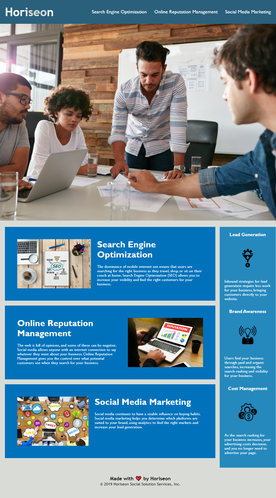
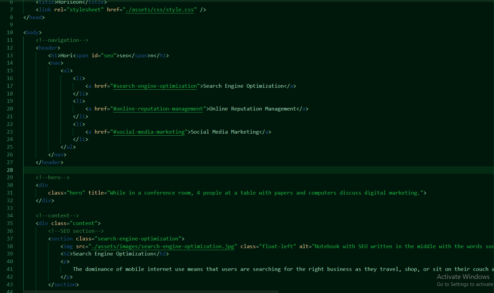

# Horiseon

Horiseon was created to help businesses with their digital marketing

## Description

Horiseon aides in search engine optimization, online reputation management, and social media marketing. This project was created to aid in meeting Horiseon's accessibility standards in which the code is now both easier due to semantic elements and a more logical order to the elements overall.

## Technologies Used

- HTML
- CSS

## Usage and Website

[Horiseon](https://kirstgonz.github.io/urban-octo-telegram/) is read more easily by a screenreader. It can be accessed by clicking on 'Horiseon' or the following link.
https://kirstgonz.github.io/urban-octo-telegram/

Below is an example of the improved usage through the code's readibility such as the implementation of the header tag in line 12 and the alt tage in line 38.

## Credits

Made by [Xander Rapstine](https://github.com/Xandromus) 

Edited by [Kirstyn Gonzalez](https://github.com/kirstgonz)

## License

[https://choosealicense.com/](https://choosealicense.com/).

